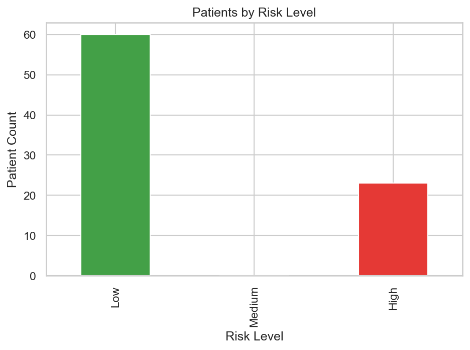
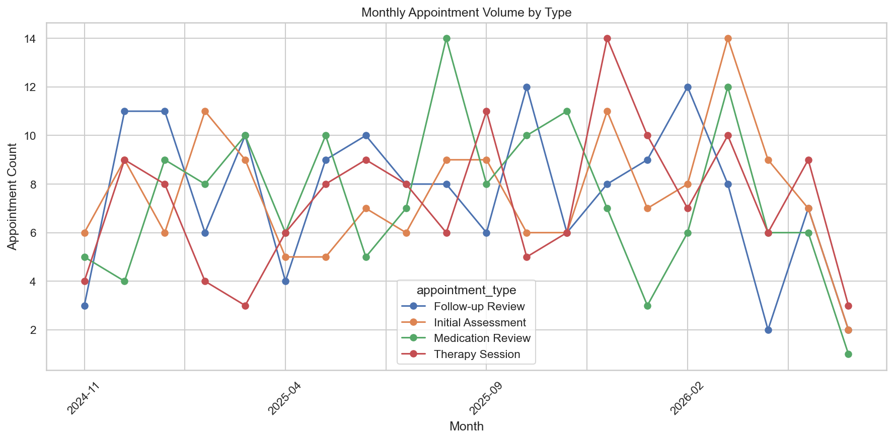
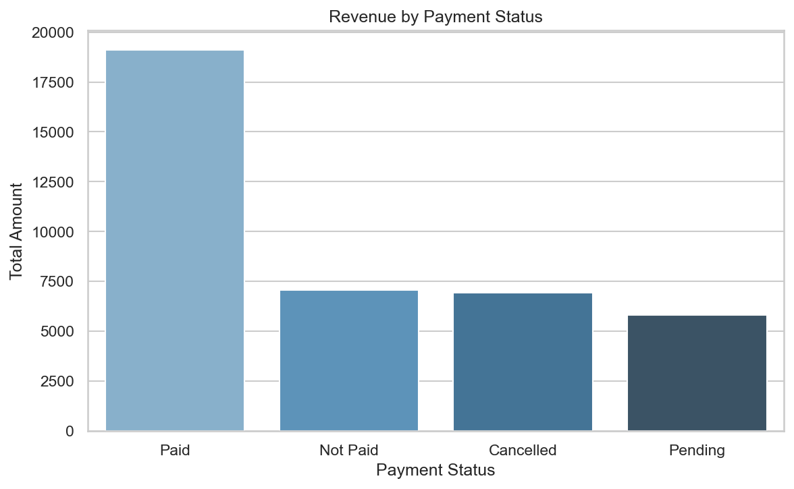
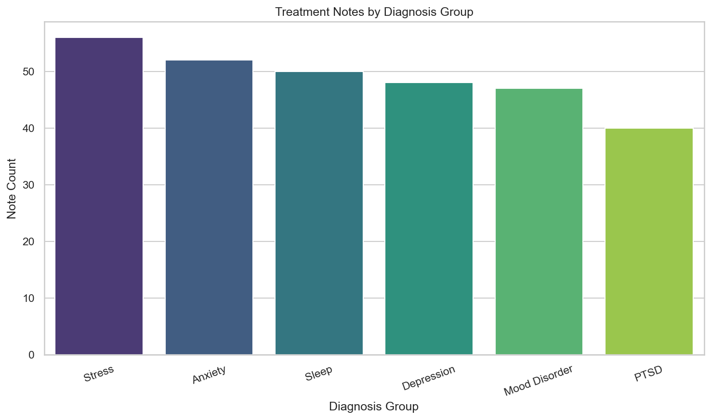

# EMR Analytics Showcase

An EMR-style analytics project built with SQLite, SQL, pandas, and Jupyter Notebook.

This project explores healthcare-style records including patients, appointments, treatment notes, payments, and lab results. It is designed as a portfolio project that shows how relational data can be queried, analysed, and presented in a clean notebook workflow.

The main analysis notebook in this package is `notebooks/emr_analytics_showcase_portfolio.ipynb`.

## Project Files

- `build_data.py`: helper logic for dataset creation
- `seed_emr_showcase.py`: rebuilds the SQLite database if needed
- `sql_queries.sql`: reusable SQL queries
- `notebooks/emr_analytics_showcase_portfolio.ipynb`: portfolio-focused notebook version
- `data/emr_showcase.db`: ready-to-use SQLite database
- `data/exports/`: exported CSV files
- `images/`: generated visuals used by the notebook and this README

## Analysis Workflow

1. Connect to the SQLite database with a robust project-relative path.
2. Inspect the core EMR-style tables and record counts.
3. Explore patient risk levels and appointment activity.
4. Analyse payment status and revenue distribution.
5. Review diagnosis-group activity from treatment notes.
6. Inspect abnormal lab results.
7. Summarise patient utilisation with a corrected revenue aggregation.

## Key Findings

- The project combines clinical and operational data in one relational SQLite database.
- Appointment patterns can be broken down by month and visit type.
- Payment status provides a quick view of collected versus pending revenue.
- Treatment-note counts give a useful proxy for diagnosis-group workload.
- The patient-utilisation query uses separate aggregates to avoid inflated revenue totals.

## Generated Visuals

### Patients By Risk Level



### Monthly Appointment Volume



### Revenue By Payment Status



### Treatment Notes By Diagnosis Group



## How To Run

Create and use a virtual environment, then install the required packages:

```bash
python -m venv .venv
.\.venv\Scripts\activate
pip install -r requirements.txt
```

Rebuild the database if needed:

```bash
python seed_emr_showcase.py
```

Open the notebook:

```bash
jupyter notebook notebooks/emr_analytics_showcase_portfolio.ipynb
```

## Notes

- The records included in this project are synthetic and suitable for portfolio use.
- The notebook is structured to be easy to review in GitHub or discuss in an interview.
- The figures are saved in `images/` so they can also be reused in project documentation.
